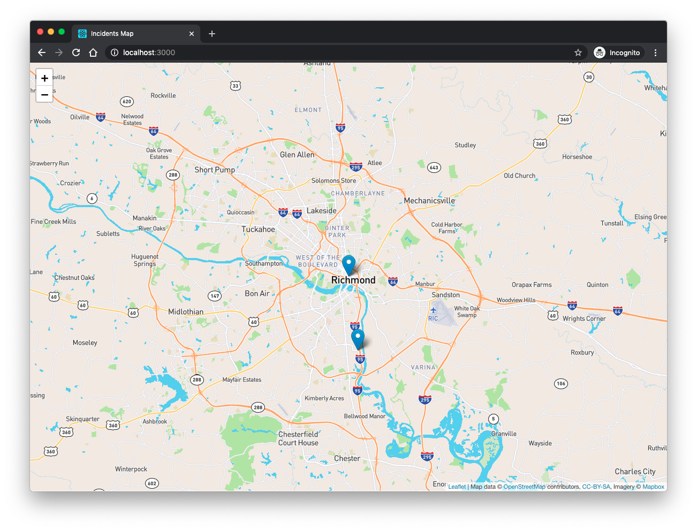
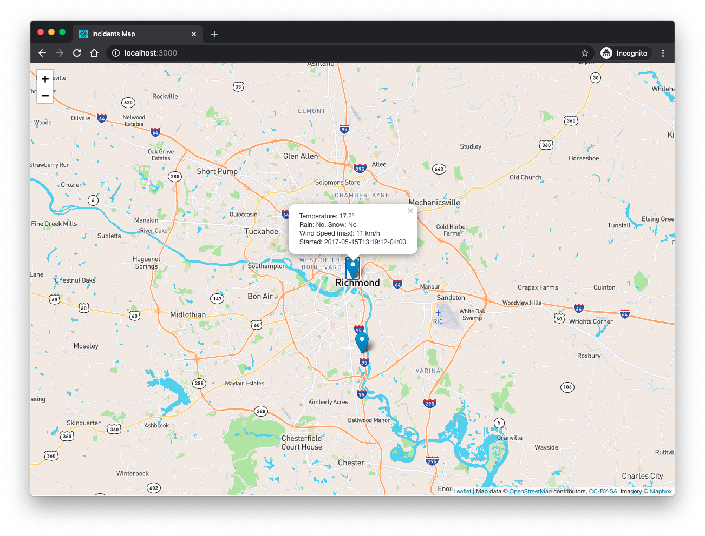
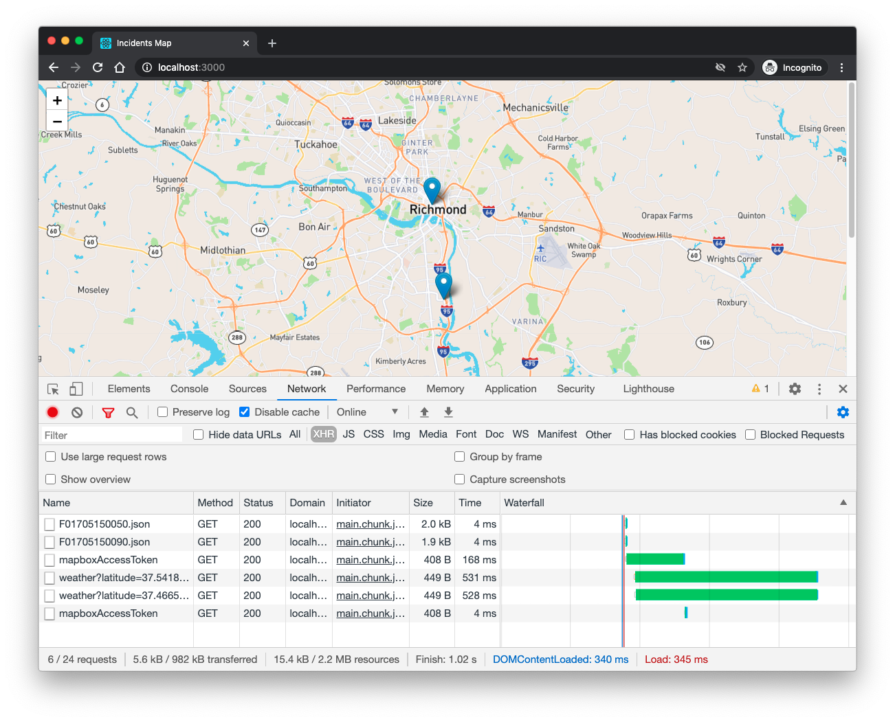
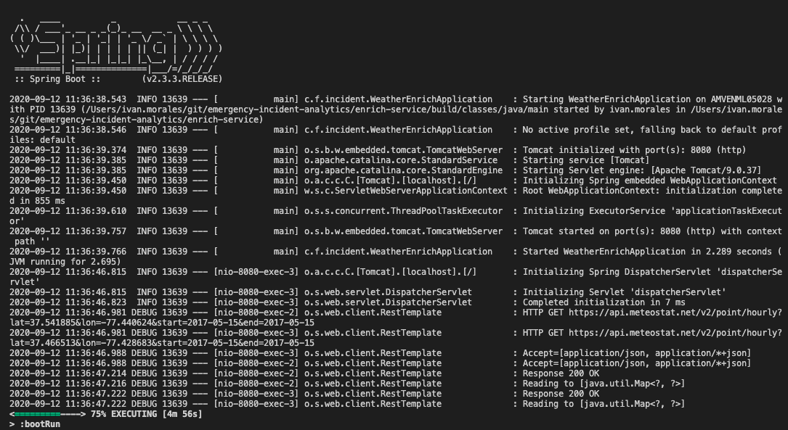

# Emergency Incident Analytics

## Steps to Install and Run App

- Download and install Node.js: https://nodejs.org/en/download/
- Download and install Java: https://adoptopenjdk.net/
- Clone Git repository: https://github.com/ivanmoralesg/emergency-incident-analytics
- Follow API Keys, Weather Enrich Backend, and Map Frontend steps below

### API Keys
- Get a Meteostat API key from https://auth.meteostat.net/
- Get a Mapbox access token from https://www.mapbox.com/studio/account/tokens/
- Put API key and access token in `enrich-service/src/main/resources/application.properties` (do not store in GitHub)

### Weather Enrich Backend:
- Change directory to `enrich-service` folder
- Run `./gradlew bootRun` to start backend service on localhost port 8080
- Browse to sample service URL at http://localhost:8080/weather?latitude=37.541885&longitude=37.541885&startTime=2017-05-15T13:19:12-04:00

### Map Frontend:
- Change directory to `incident-map` folder
- Run `npm install` to install Node dependencies
- Run `npm run start` to start a local React development server

**View the running application here: http://localhost:3000**

## Improvements / Fixes

- Set map center based on incident data (instead of hard-coding Richmond)
- Read API keys from external configuration or a service like AWS Secrets Manager if running on AWS
- Write unit tests for WeatherEnrichService.java service
- Write unit tests for IncidentMap.js React component 

## Work Time

- I spent closer to 6 hours in the first round trying the `google-react-map` React component
- Spent another 8 hours in the second round switching to Leaflet and moving the enrich logic to a Spring backend
- Most of the time was discovery, iterative coding, and testing:
  - Testing the Meteostat API PostMan
  - Learning about `google-react-map` and discarding it later
  - Learning about Leaflet 
  - Incorporating Leaflet calls in React component
  - Writing a Spring backend to filter Meteostat data by incident location and time
  - Dealing with asynchronous calls to Spring back end in JavaScript
  - Combining JSON incident data with Meteostat weather data
  - Building the `<IncidentMap>` React component
  - Building the `WeatherEnrichService.java` web service
  - Writing documentation in this README.md

 ## Screenshots

Map with markers:

Map with markers and weather info popups: 

Chrome DevTools network tab:

Spring Boot enrich service logs:

